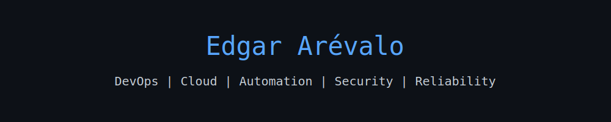

<!-- Banner superior -->

  

# 👋 Hola, soy **Edgar Arévalo**

**Linux System & DevOps Engineer | Cloud Architect | Platform Reliability Specialist**

Soy un ingeniero especializado en **Infraestructura como Código (IaC)**, **plataformas en la nube** y **entornos de contenedores**, con un enfoque fuerte en **automatización, observabilidad y seguridad**.  
Diseño, implemento y mantengo arquitecturas escalables, resilientes y seguras en **Oracle Cloud (OCI)**, **Azure** y **GCP**, aplicando prácticas sólidas de **DevOps, SRE y Cloud Security**.

---

## 🧠 Stack principal

### ☁️ Cloud & Infra
- **Oracle Cloud Infrastructure (OCI)**, **Microsoft Azure**, **Google Cloud Platform (GCP)**
- Virtual Cloud Networks, Bastion Hosts, NSG, Load Balancers, Route Tables
- **OCI CLI**, **Azure CLI**, **Terraform Cloud / OpenTofu**

### ⚙️ IaC & Automation
- **Terraform / OpenTofu**, **Helm**, **Ansible**, **Bash scripting**
- Módulos reutilizables, control de versiones, pipelines GitOps con **ArgoCD**

### 🧩 Containers & Orchestration
- **Docker**, **Docker Compose**, **Kubernetes (OKE / AKS / GKE)**
- **Traefik v3**, **Grafana Tempo**, **Loki-stack**, **Prometheus-stack**
- Despliegues multi-entorno y multi-servicio

### 🔄 CI/CD & DevOps
- **Azure DevOps Pipelines**, **GitLab CI**, **SonarCloud**, **GitVersion**
- Pipelines modulares para Build / Sonar / Deploy / Container Apps
- Control semántico de versiones (SemVer, GitVersion, tags dinámicos)

### 🗄️ Databases & Observabilidad
- **PostgreSQL**, **MySQL Flexible Server**, **MariaDB**
- Backups, replicación, archivado y monitoreo con **Percona PMM**
- **Grafana**, **Loki**, **Tempo**, **Prometheus**, **Alertmanager**

### 🔐 Seguridad & Compliance
- **ISO 27001**, **SOC2**, **DMARC/SPF/DKIM**
- **CrowdSec**, **Suricata**, **pfSense**, **iptables**, **Wazuh**
- Segmentación de red, hardening, auditorías y controles de acceso

---

## 🧰 Herramientas & Tecnologías

  
  
  
  
  
  
  
  
  
  
  
  
  

---

## 🧩 Proyectos personales

- 🔧 **Infraestructura modular multi-cloud**  
  Diseño y despliegue automatizado con Terraform Cloud y OpenTofu, adaptable a OCI, Azure y GCP.

- 🧱 **Stack de monitoreo y observabilidad**  
  Integración de Grafana Tempo + Loki + Prometheus + Alertmanager para entornos Kubernetes y bare-metal.

- 🧬 **Automatización de correos seguros (Postfix + ClamAV + SpamAssassin)**  
  Script/API para clasificación automatizada de correos (virus, spam, phishing) con base de datos PostgreSQL.

- 🛰️ **Laboratorio de red (WireGuard + Bird v2 + Ceph + Proxmox)**  
  Topología BGP con túneles WireGuard, almacenamiento Ceph distribuido y HA firewalls en entorno homelab.

---

## 📊 Estadísticas de GitHub

  
  

---

## 📫 Conecta conmigo

  
  

---

> 💡 *“La automatización no solo ahorra tiempo, también crea consistencia, seguridad y resiliencia.”*
